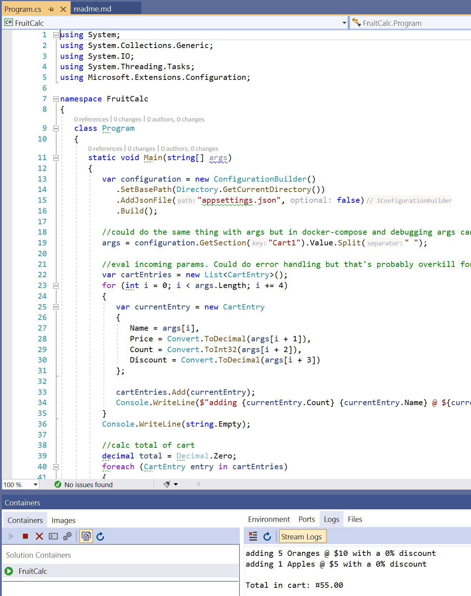

## Description
Code example that runs a debuggable container from Visual Studio with docker-compose integration

## Requirements
You must have Visual Studio and Docker Desktop installed to run this

## Running
* Clone master
* Set docker-compose to startup
* Feel free to put in a breakpoint in `Program.cs`
* Hit F5/Run
* Feel free to change `appsettings.json` values and/or change line 19 in `Program.cs` to load the second cart: `GetSection("Cart2")`
* View container logs for output in VS or using CLI. Should look like this:  
